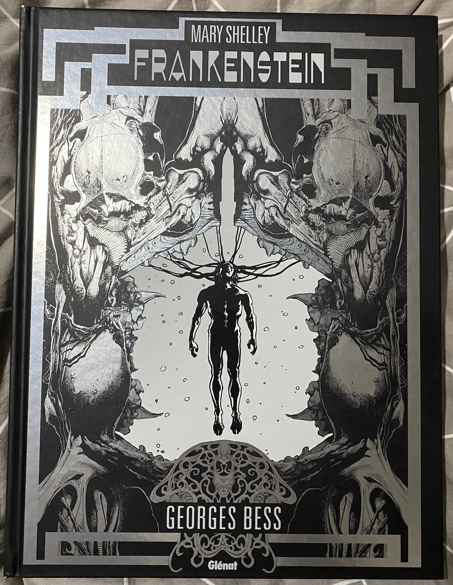
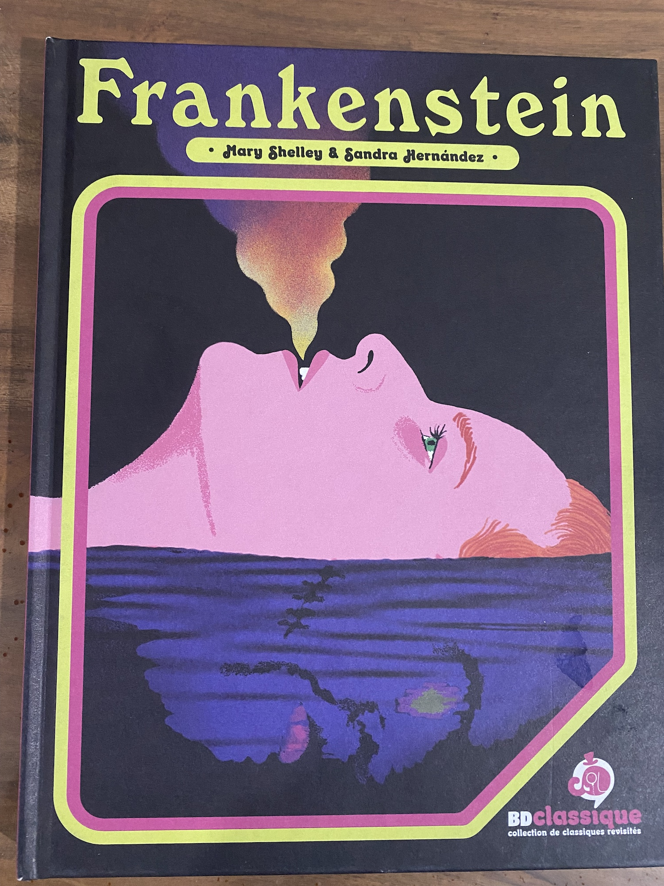
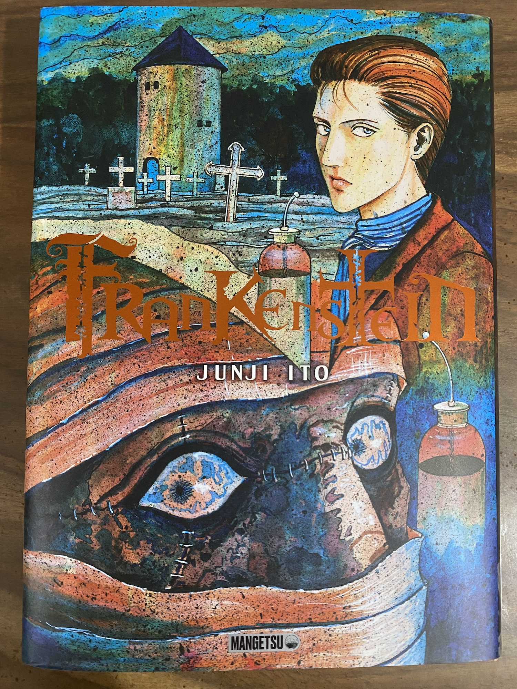

Lecture consécutives de 3 adaptations BD de **Frankenstein** que ma grande fille, fan de romans gothiques du 19ème siècle, a achetées. Les trois sont très bien !

Celle de Georges Bess, très grand format, est sombre, grandes images, peu de texte, très fidèle avec le roman.

Celle de Sandra Hernández, adaptation féminine, est assez fidèle aussi, le dessin est moins net, le monstre une ombre noire, l'accent est mis sur la genèse, la relation génitrice/créature, sans dénaturer l'histoire.

Celle de Junji Ito comporte bien sûr plus d'horreur visuelle, mais aussi beaucoup plus de dialogues que les deux autres adaptations. Elle est très fidèle, sauf pour la fin qui a été modifiée.

J'ai aimé les 3, avec une préférence pour les versions de Junji Ito et Georges Bess.
