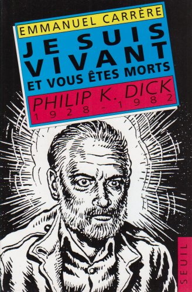

**Note** : Article de 2019 que je n'avais pas mis en ligne.

J’ai lu « **D’autres vies que la mienne** » d’Emmanuel Carrère, qu’un collègue et ami, grand fan de l’auteur, m’a offert. 

C’est une histoire de vie, de maladie, de morts, celle d’une fillette de 4 ans dans le terrible tsunami de 2004 au Sri Lanka, celle d’une juge de tribunal d’instance, belle-sœur de Carrère, morte d’un cancer peu après. Comme dans beaucoup de ses livres Emmanuel Carrère parle un peu de lui-même tout en racontant la vie des autres. 

C’est vraiment très bien écrit, très émouvant, parfois difficile à lire (notamment quand tu as des enfants jeunes…), parfois drôle aussi malgré les événements tragiques.

Je le recommande chaudement, Carrère est à mon avis un très grand écrivain, même s’il est très tourmenté (et sans doute très bon grâce à ses tourments) et qu’il dit parfois des bêtises, notamment sur la psychanalyse 😬

Parmi ses autres livres, j'ai notamment adoré « **Je suis vivant et vous êtes morts** », une biographie de l'écrivant de science-fiction déjanté (et pas mal drogué) Philip K. Dick.

