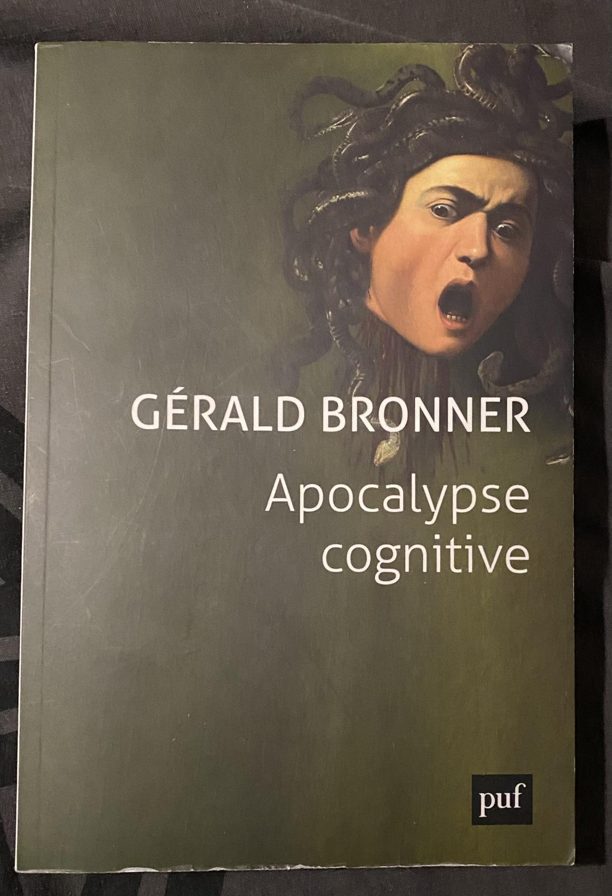
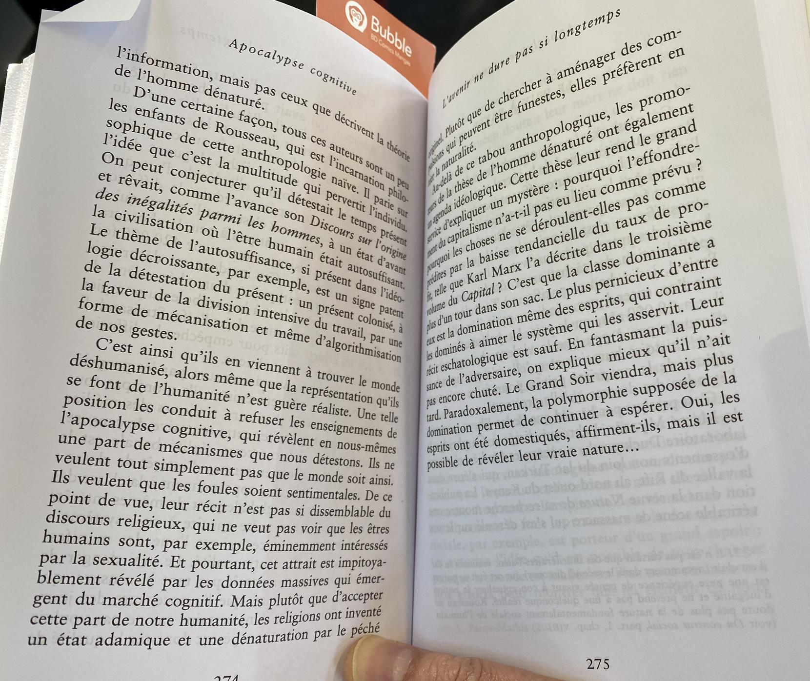
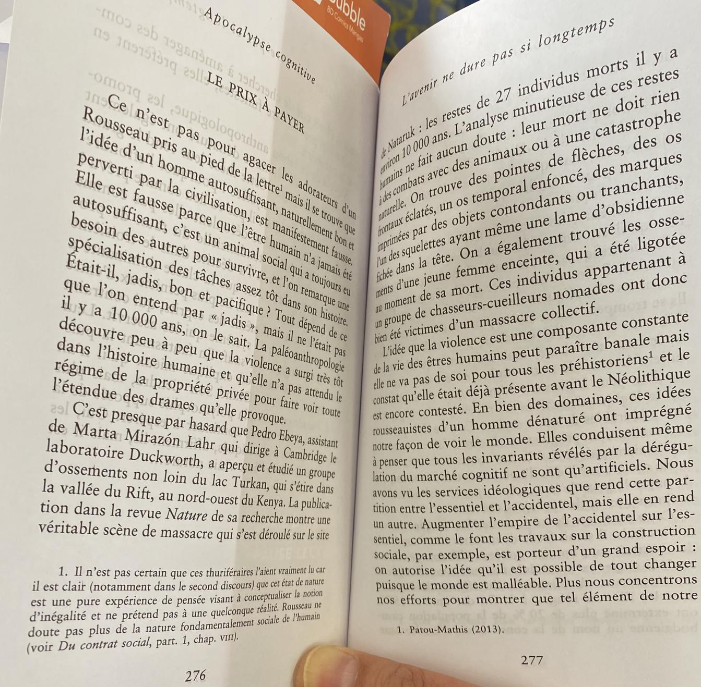
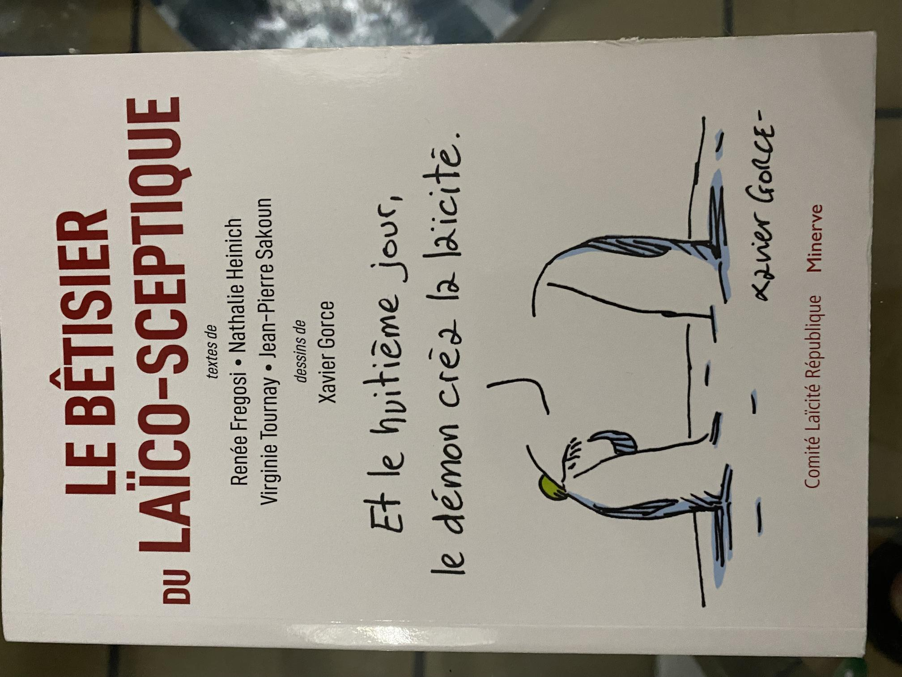
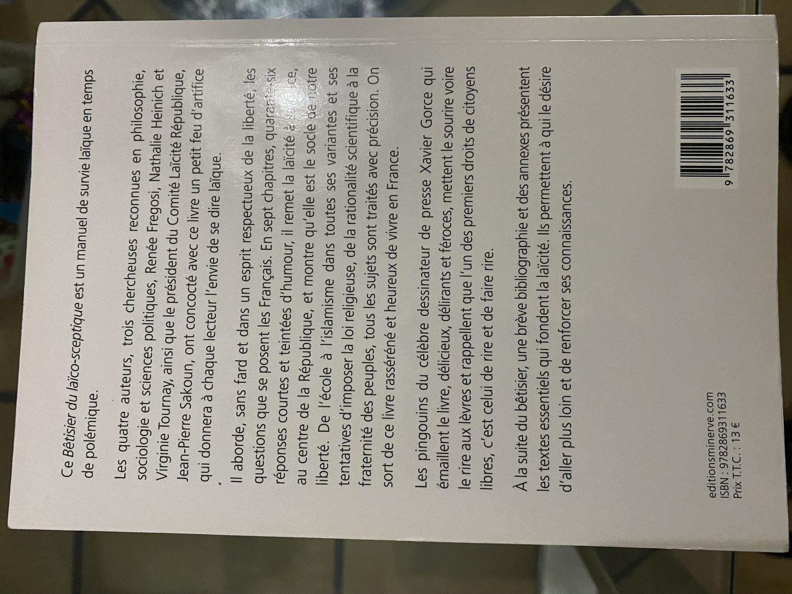
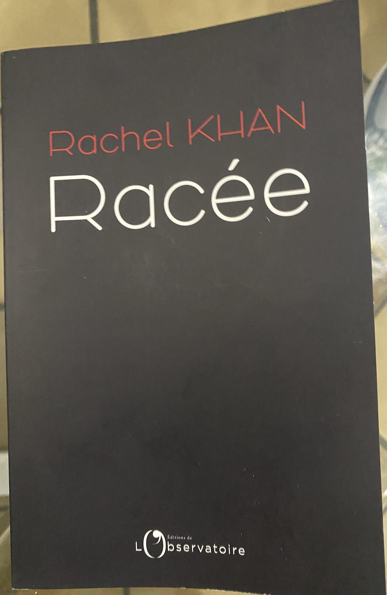

# Introduction

In these paradoxically obscurantist times, even though science, society and knowledge progress faster than ever, I think the following three readings are a must.

Human knowledge is progressing in all fields, whether in hard sciences or in social sciences, the world is *globally* more and more at peace, we have more and more **factual** information at our disposal…

And yet there are more and more people who believe in conspiracy theories, each one more stupid than the other! Other categories of professional liars want to pit people against each other according to their *race*, gender, skin color. And a third category of liars, which often crosses the two others, wants a resurgence of religion and all the evils that go with it: rejection of science, social regression, regression of women's rights, violence, manipulation...

One of the plausible causes is the amount of hateful, misleading and conspiracy information that can be found on social networks. For the last year or two, I have found reading the news anxiety-provoking and, even though I have cleaned up my newsfeeds on social networks, the positive, universalist and sensible people I am, post virulent messages in defense of rationality, secularism, human rights, or re-share to criticize them the hateful and misleading messages of people I don't want to follow.

But when there is so much nuanced and factual information at our fingertips, why do we read more of the misleading, aggressive or conspiracy-oriented articles?

It becomes impossible to be heard as a universalist and rationalist without raising our voice. What's going on? :worried:

# Apocalypse cognitive

In order to understand a little bit what is going on, the reading of **Apocalypse Cognitive** by **Gérald Bronner**, a famous sociologist (and strongly criticized by the pseudo-sociologists of the extreme left, that's a good sign!) seems to me indispensable. I have already read several of his books, and I have briefly talked about them here:
- [Le danger sociologique]()
- [La démocratique des crédules]()

This one is in the same vein: quite easy to read (no hard vocabulary or abstruse concepts) and salutary. Even if once again the author doesn't bring a miracle solution, he explains where the problem comes from (once again our poor brain) and gives us and our leaders some ways to act.

This [article by France Culture](https://www.franceculture.fr/oeuvre/apocalypse-cognitive), in French, explains perfectly the theme of the book:

> *The situation is unprecedented. Never in the history of mankind have we had so much information at our disposal and never have we had so much free time to draw leisure and knowledge of the world. Our predecessors dreamed that science and technology would liberate humanity. But this dream may now turn into a nightmare. The flood of information has led to a generalized competition of all ideas, a deregulation of the "cognitive market" which has an unfortunate consequence: to capture, often for the worse, the precious treasure of our attention. Our minds are under the spell of the screens and give in to the thousand faces of unreason.*

> *Victim of a plundering in rule, our spirit is in the middle of a stake on which our future depends. This disturbing context reveals some of the deepest aspirations of humanity. Is it time to confront our own nature? On the way we react will depend the possibilities to escape from what we must call a civilizational threat.*

Here is a passage from the book that I particularly liked, in French:

I find indeed that Jean-Jacques Rousseau is too much venerated in France, considering the nonsense he says about "man is good by nature, but perverted by civilization". His words might have made sense with the limited scientific knowledge of his time, but in our time, it is absurd! I have a bad memory of my philosophy classes in which we were told about "*Rousseau… the good savage man… blah blah…" until we were nauseated.

**Note** : I read earlier this article by Yascha Mounk, ["Facebook and the moral panic"](https://www.lexpress.fr/actualite/idees-et-debats/facebook-et-la-panique-morale-par-yascha-mounk_2162204.html). He says that we should not blame the hysterization of debates only on social networks. He is right to say that Facebook is not the only culprit, but Facebook's *Metaverses* are an amplifier of the cognitive failings that Gérald Bronner describes.

In any case, the reading of **Apocalypse Cognitive** is salutary!

# Le bêtisier du laïco-sceptique

Next reading, which completes the previous one very well. A small book in the form of questions and answers with an extract from the major texts on secularism at the end of the book: Declaration of the Rights of Man and of the Citizen of 1789, Law of Separation of Church and State of 1905, Law on the Freedom of the Press of 1881...

"**Le bêtisier du laïco-sceptique**" by Renée Fregosi, Nathalie Heinich, Virginie Tournay and Jean-Pierre Sakoun is published by the **Comité Laïcité République**.

This committee has just recently awarded the [2020 and 2021 Secularism Awards](https://www.laicite-republique.org/les-prix-de-la-laicite-decernes-a-laurent-bouvet-kamel-daoud-rachel-khan.html). The master of ceremonies is none other than **Gérald Bronner** and one of the 2021 laureates **Rachel Khan**, whose book I talk about below. I see it as a very good choice, showing that the themes of all these books are linked. But maybe others will see it as… **a plot**! :sweat_smile:

I said above that our time, which should be more and more rational with the progress of knowledge, becomes paradoxically more obsessed by religions, and I regret it. This resurgence of the religious fact leads the fundamentalists, the believers and all the idiotic allies of religions (The Regressive Left generally speaking) to deform the French secularism and to make it say false things, even to demonize it!

This book puts things in their place: there is only one secularism, it has been present in our history since the French Revolution, and it is not *against* religions. On the other hand, it puts religions back where they should remain, in the private sphere, and it defends the freedom to believe and **not to believe**.

The drawings of [Xavier Gorce](https://xaviergorce.com/), collateral victim of the growing [*wokism* of the newspaper **Le Monde**](https://www.franceinter.fr/emissions/l-invite-de-7h50/l-invite-de-7h50-05-mai-2021), illustrate very well this article.

# Racée

Third salutary reading, Rachel Khan's **Racée**, which won the **National Secularism Award 2021**. I mentioned earlier wokism and the emergence of *Critical Theories* on race, sex, gender, etc. This is what Rachel Khan denounces in her book with humor and intelligence.

She comes from a melting pot, with a Gambian father and a French mother of Polish-Jewish origin, "_Afro-Yiddish Tourangelle_", and refuses to accept identity-based distinctions. She is a universalist and dismantles in this book all the indigenist and racialist hatred that is emerging in France and in other countries.

# Conclusion

These three books go really well together, the news of the awarding of the [**Prix de laïcité**](https://www.laicite-republique.org/les-prix-de-la-laicite-decernes-a-laurent-bouvet-kamel-daoud-rachel-khan.html) reinforces even more the intellectual connivance between the three themes.

All three books are overall positive and calming to read, rather than stirring up hatred like a lot of content in social networks or the media right now. I highly recommend them to people who are interested in critical thinking and universalism.
