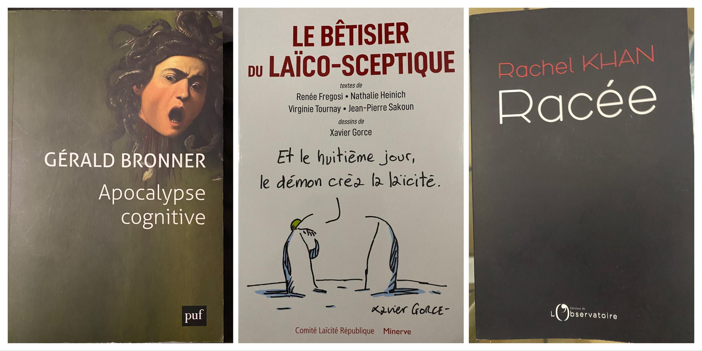
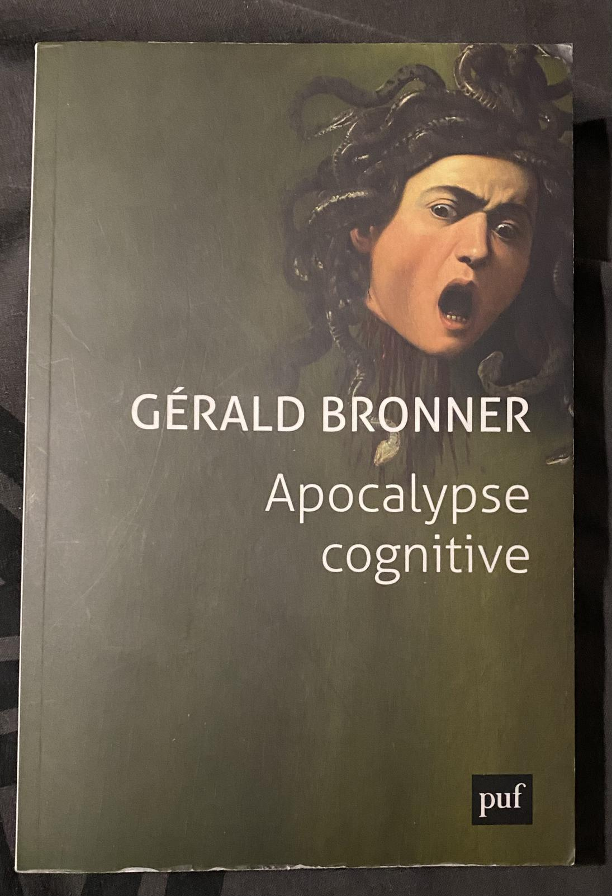
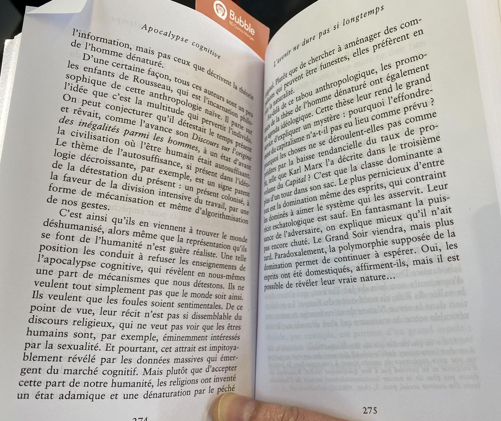
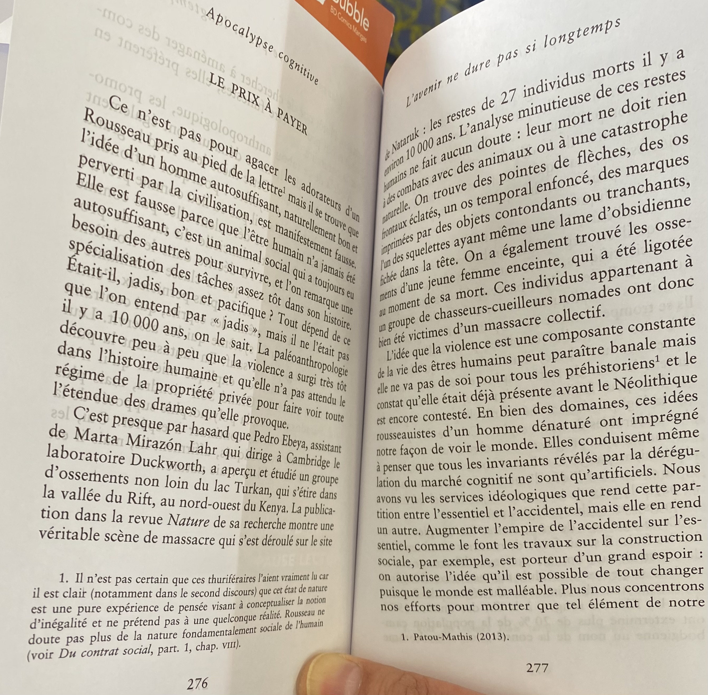
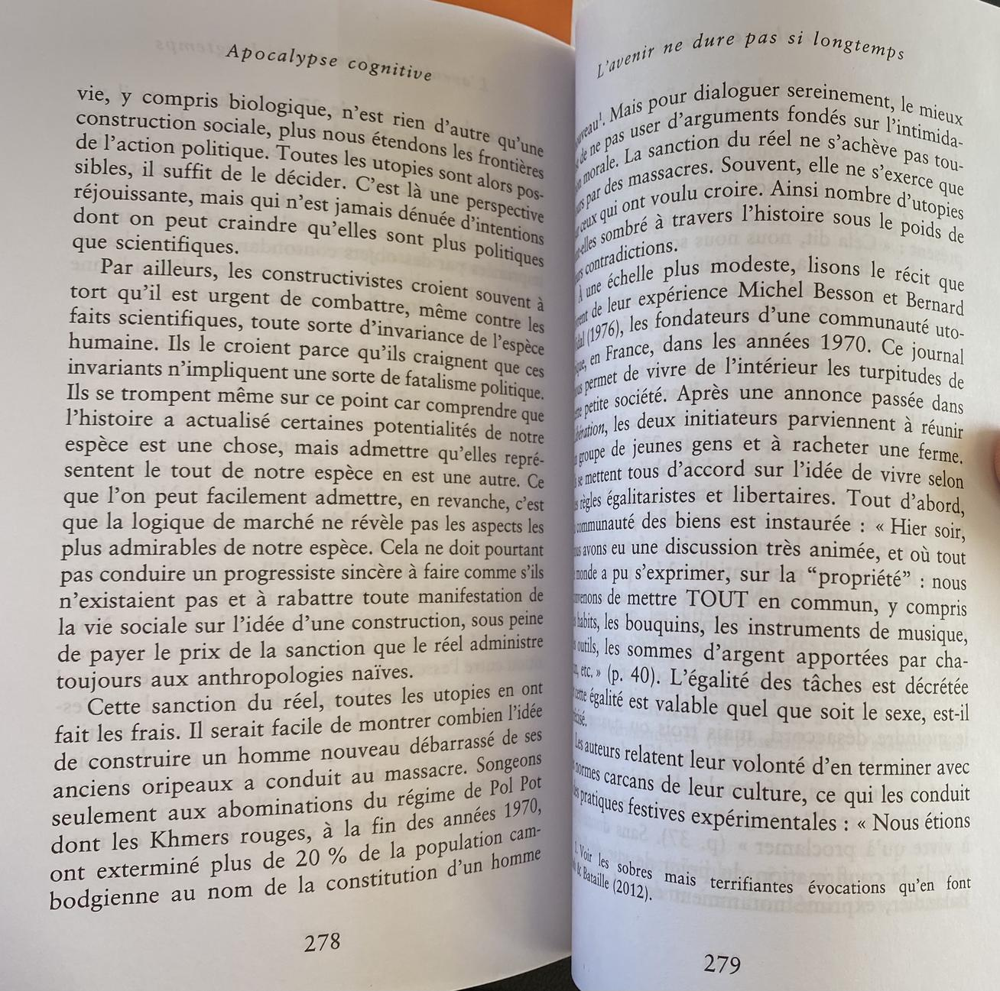
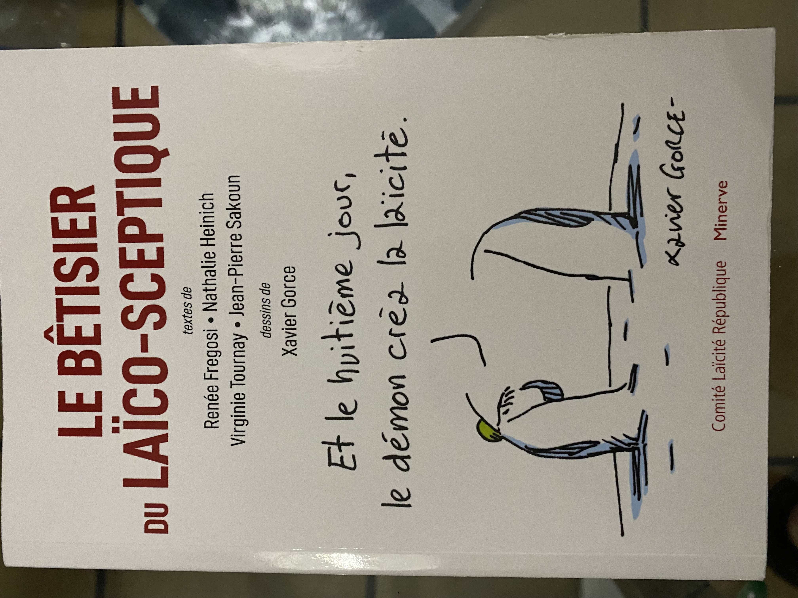
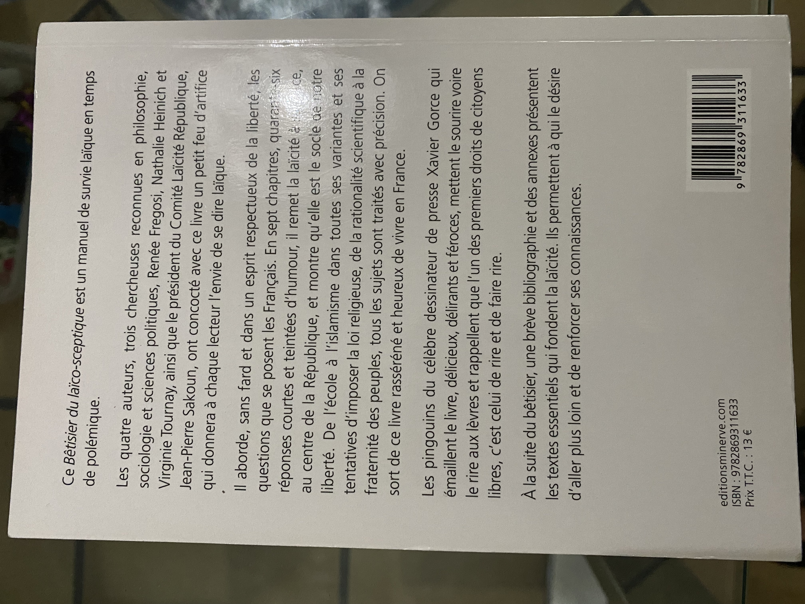
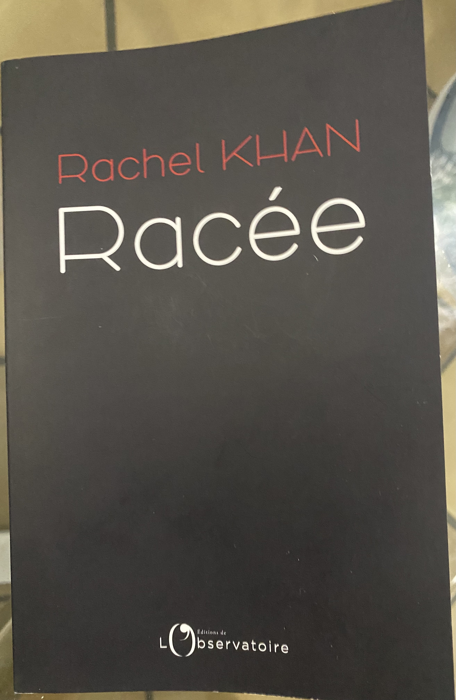
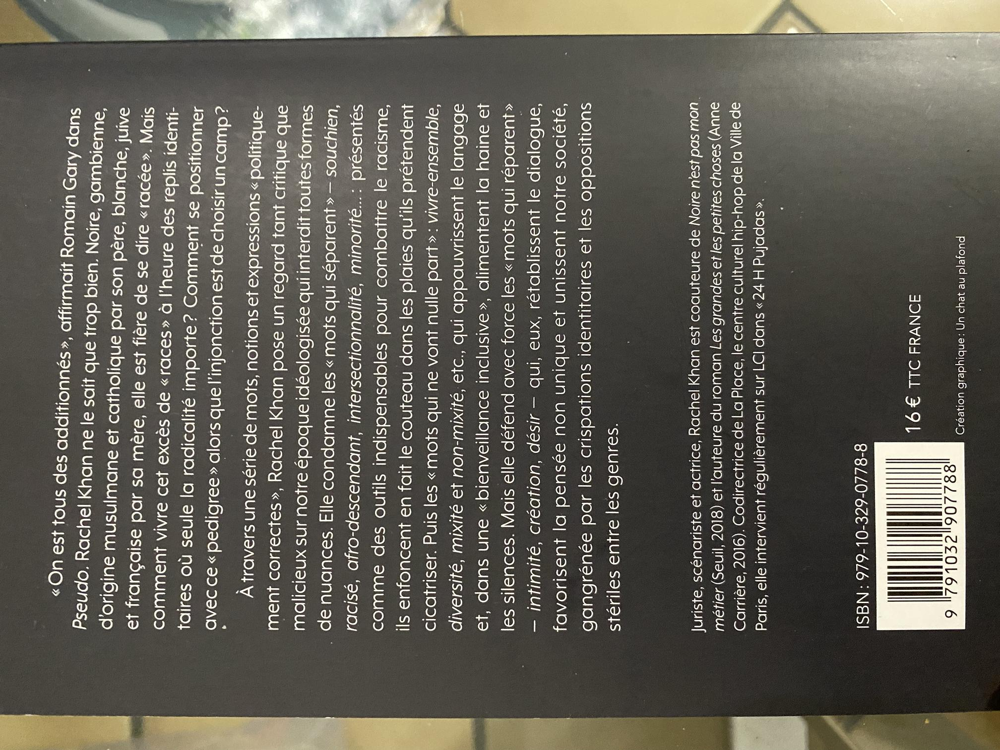

# Introduction

En ces temps paradoxalement obscurantistes, alors que la science, la société et les connaissances ne font que progresser, je pense que les trois lectures suivantes sont indispensables.

Les connaissances humaines progressent dans tous les domaines, que ce soit en sciences dures ou en sciences sociales, le monde est *globalement* de plus en plus en paix, nous avons de plus en plus d'informations **factuelles** à notre disposition… 

Et pourtant il y a de plus en plus de gens qui croient à des théories complotistes toutes plus débiles les unes que les autres ! D'autres catégories de menteurs professionnels veulent monter les gens les uns contre les autres en fonction de leur *race*, sexe, couleur de peau. Et une troisième catégorie de menteurs, qui croise souvent les deux autres, veut une résurgence de la religion ainsi que tous les maux qui vont avec : rejet des sciences, recul social, recul du droit des femmes, violence, manipulation…

Une des causes plausibles est la quantité d'information haineuse, mensongère et complotiste que l'on trouve sur les réseaux sociaux. Depuis un an ou deux, je trouve la lecture des informations anxiogènes et, même si j'ai fait du ménage dans mes flux d'informations sur les réseaux sociaux, les gens positifs, universalistes et sensés que je suis, postent des messages virulents en défense de la rationalité, de la laïcité, des droits humains, ou repartagent pour les critiquer les messages haineux et mensongers des gens que je ne veux pas suivre.

Mais alors qu'il y a tant d'informations nuancées et factuelles à portée de clic, pourquoi lisons-nous plus les articles mensongers , agressifs ou complotistes ?

Il devient impossible de se faire entendre en tant qu'universaliste et rationnel sans devoir hausser le ton. Que se passe-t-il ? :worried:

# Apocalypse cognitive

Pour pouvoir comprendre un peu ce qui se passe, la lecture d'**Apocalypse Cognitive** de **Gérald Bronner**, sociologue réputé (et vivement critiqué par les pseudo-sociologues d'extrême-gauche, c'est un bon signe !) me semble indispensable. J'ai déjà lu plusieurs de ses livres et j'en ai brièvement parlé ici :
- [Le danger sociologique]()
- [La démocratique des crédules]()

Celui-ci est dans la même veine : assez facile à lire (pas de vocabulaire et de concepts abscons) et salutaire. Même si encore une fois l'auteur n'apporte pas de solution miracle, il explique d'où vient le problème (encore une fois notre pauvre cerveau) et des pistes d'actions pour nous et pour nos gouvernants.

Cet [article de France Culture](https://www.franceculture.fr/oeuvre/apocalypse-cognitive) explique parfaitement le thème du livre :

> *La situation est inédite. Jamais, dans l’histoire de l’humanité, nous n’avons disposé d’autant d’informations et jamais nous n’avons eu autant de temps libre pour y puiser loisir et connaissance du monde. Nos prédécesseurs en avaient rêvé : la science et la technologie libéreraient l'humanité. Mais ce rêve risque désormais de tourner au cauchemar. Le déferlement d’informations a entraîné une concurrence généralisée de toutes les idées, une dérégulation du « marché cognitif » qui a une fâcheuse conséquence : capter, souvent pour le pire, le précieux trésor de notre attention. Nos esprits subissent l’envoûtement des écrans et s’abandonnent aux mille visages de la déraison.*

> *Victime d’un pillage en règle, notre esprit est au cœur d’un enjeu dont dépend notre avenir. Ce contexte inquiétant dévoile certaines des aspirations profondes de l’humanité. L’heure de la confrontation avec notre propre nature aurait-elle sonné ? De la façon dont nous réagirons dépendront les possibilités d'échapper à ce qu'il faut bien appeler une menace civilisationnelle.*

Voici un passage du livre que j'ai particulièrement aimé :

Je trouve en effet qu'on vénère trop Jean-Jacques Rousseau en France, vu les bêtises qu'il dit sur "_l'homme bon par nature perverti par la civilisation_". Ses propos faisaient peut-être sens avec le niveau de connaissance scientifique limité de son temps mais, à notre époque, c'est absurde ! J'ai gardé un mauvais souvenir de mes cours de philosophie dans lesquels on nous répétait « *Rousseau… l'homme sauvage bon… blah blah…* » jusqu'à la nausée.

**Note** : J'ai lu tout à l'heure cet article de Yascha Mounk, [« Facebook et la panique morale »](https://www.lexpress.fr/actualite/idees-et-debats/facebook-et-la-panique-morale-par-yascha-mounk_2162204.html). Il dit qu'il ne faut pas imputer aux seuls réseaux sociaux l'hystérisation des débats. Il a raison de dire que Facebook n'est pas le seul fautif, mais les *Metaverses* de Facebook sont un amplificateur des travers cognitifs que Gérald Bronner décrit.

Dans tous les cas, la lecture d'**Apocalypse Cognitive** est salutaire !

# Le bêtisier du laïco-sceptique

Lecture suivante, qui complète très bien la précédente. Petit livre sous forme de questions-réponses avec un extrait des textes majeurs sur la laïcité en fin d'ouvrage : Déclaration des droits de l'Homme et du Citoyen de 1789, loi de séparation de l'Église et de l'État de 1905, loi sur la liberté de la presse de 1881… 

« **Le bêtisier du laïco-sceptique** » de Renée Fregosi, Nathalie Heinich, Virginie Tournay et Jean-Pierre Sakoun est édité par le **Comité Laïcité République**

Ce comité vient d'ailleurs de remettre récemment les [Prix de la Laïcité 2020 et 2021](https://www.laicite-republique.org/les-prix-de-la-laicite-decernes-a-laurent-bouvet-kamel-daoud-rachel-khan.html). Le maître de cérémonie n'est autre que **Gérald Bronner** et une des lauréates 2021 **Rachel Khan**, dont je parle du livre plus bas. Moi j'y vois un très bon choix, qui montre que les thèmes de tous ces livres sont liés. Mais peut-être que d'autres y verront justement… **un complot** ! :sweat_smile:

Je disais plus haut que notre époque, qui devrait être de plus en plus rationnelle avec le progrès des connaissances, devient paradoxalement plus obnubilé par les religions, et je le regrette. Cette résurgence du fait religieux amène les intégristes, les grenouilles de bénitier et tous les idiots utiles des religions à déformer la laïcité à la française et à lui faire dire des choses fausses, voire à la diaboliser !

Ce livre remet les choses à leur place : il n'y a qu'une seule laïcité, elle est présente dans notre histoire depuis la Révolution Française, et elle n'est pas *contre* les religions. Par contre, elle remet les religions là où elles devraient rester, dans la sphère privée, et elle défend la liberté de croire et de **ne pas croire**.

Les dessins de [Xavier Gorce](https://xaviergorce.com/), victime collatérale du [*wokisme* croissant du journal **Le Monde**](https://www.franceinter.fr/emissions/l-invite-de-7h50/l-invite-de-7h50-05-mai-2021), illustre très bien cet article.

# Racée

Troisième lecture salutaire, « **Racée** » de Rachel Khan, qui a emporté le **Prix National de la Laïcité 2021**. J'évoquais précédemment le wokisme et l'émergence des *Théories Critiques* sur la race, le sexe, le genre, etc. C'est tout ce que Rachel Khan dénonce dans son livre avec humour et intelligence.

Elle qui est issue d'un melting-pot, père gambien, mère française d'origine juive polonaise, « _Afro-Yiddish tourangelle_ », refuse les **assignations identitaires**. Elle est universaliste et démonte dans ce livre toute la haine indigéniste et racialiste qui émerge en France et dans d'autres pays.

# Conclusion

Ces trois livres vont vraiment bien ensemble, l'actualité de la remise du [**Prix de la laïcité**](https://www.laicite-republique.org/les-prix-de-la-laicite-decernes-a-laurent-bouvet-kamel-daoud-rachel-khan.html) renforce encore plus les connivences intellectuelles entre les trois thèmes.

Les trois ouvrages sont globalement positifs et leur lecture apaise, plutôt que d'attiser la haine comme beaucoup de contenu dans les réseaux sociaux ou les médias en ce moment. Je les recommande chaudement aux personnes qui s'intéressent à l'esprit critique et à l'universalisme.
