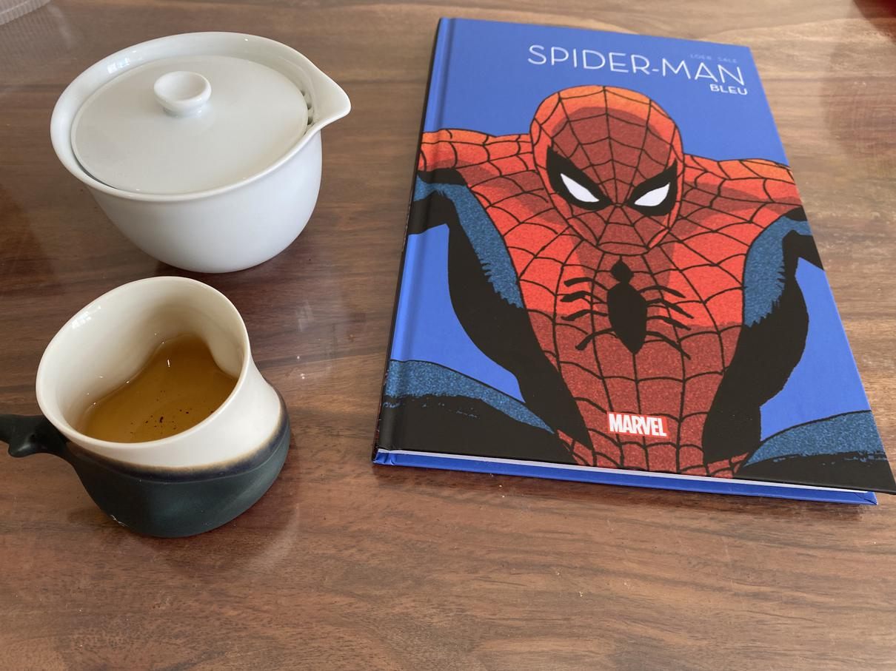

**Note** : Article published with delay.

# Death Note artbook

I am a fan of **Death Note**. It was only natural that I would fall for a great artbook of **Takeshi Obata**'s works!

There are drawings from Death Note as well as other works by him that I don't know. And everything is splendid!

# Death Note Short stories

Some short stories in the universe of Death Note a few years after the main plot and humorous strips.

The stories are a nice read, but are less elaborated, it's still honorable, but not exceptional.
As for the strips, they show me how Japanese humor sometimes seems so different from mine…
It's like the humor page at the end of each volume of **Attack on Titans**, almost embarrassing :sweat_smile:

# Spiderman - Blue

First volume of the 2021 collection of the Marvel 10, **Spider-Man - Blue** : excellent duo of scriptwriter
and drawer, nice story. But like many Marvel or DC Comics, you need to have already read or seen other stories to understand everything.

# Batman DC Rebirth #3 Mon nom est Bane

"Batman Rebirth - My name is Bane" is the 3rd volume of the "DC Rebirth" series.
I really like the character of Bane, and Selina Kyle too :smile:

# Stormtroopers

And I cracked up after an ad from my favorite comic book store this morning, I rushed out to buy the bookends and the three Stormtroopers in "monkey wisdom" style. It takes an elite troop to hold off Bane :smiley:

# Blacksad

And there was also a mock journal **Blacksad** that caught my eye.
