**Note** : Article publié avec retard.

# Death Note artbook

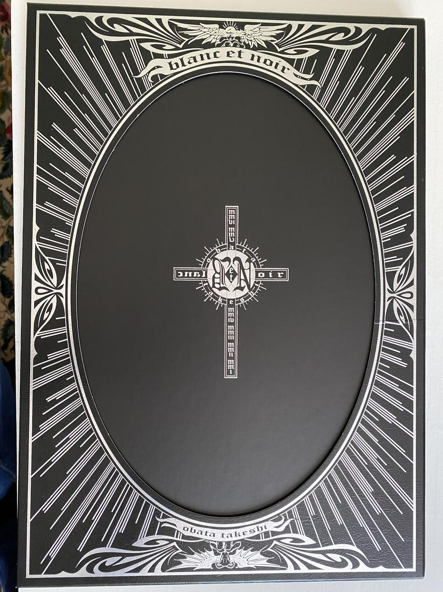

Je suis un fan de **Death Note**. Il était normal que je craque pour un grand artbook des œuvres de **Takeshi Obata**! 

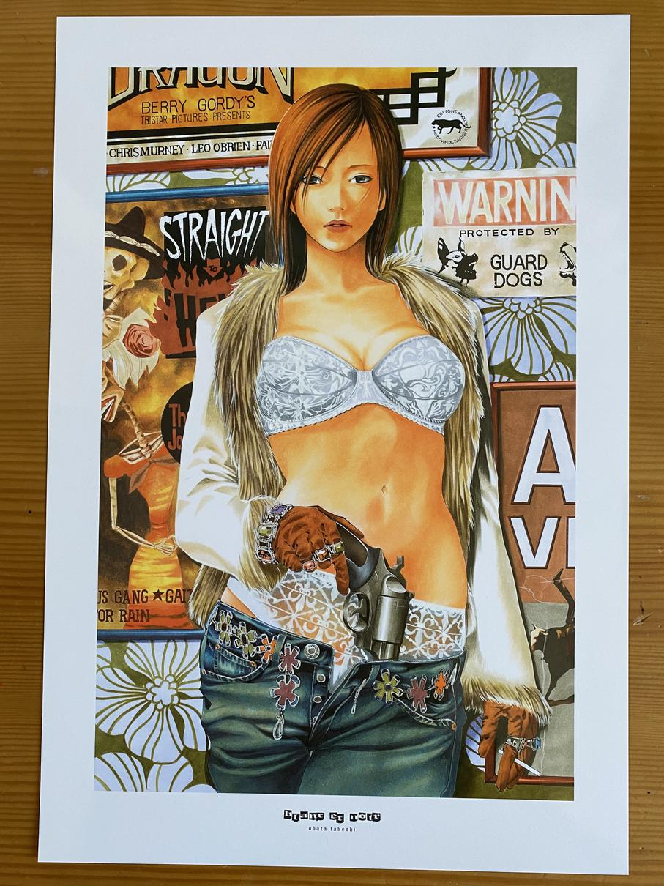

Il y a aussi bien des dessins tirés de Death Note que d'autres œuvres de lui que je ne connais pas. Et tout est splendide !

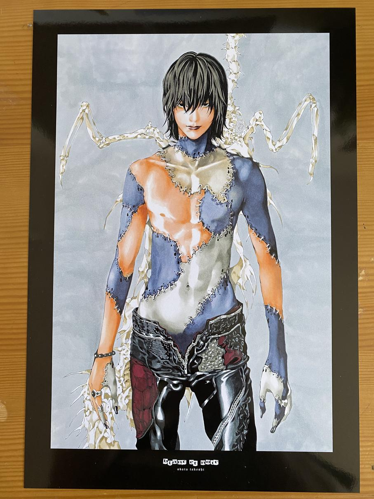

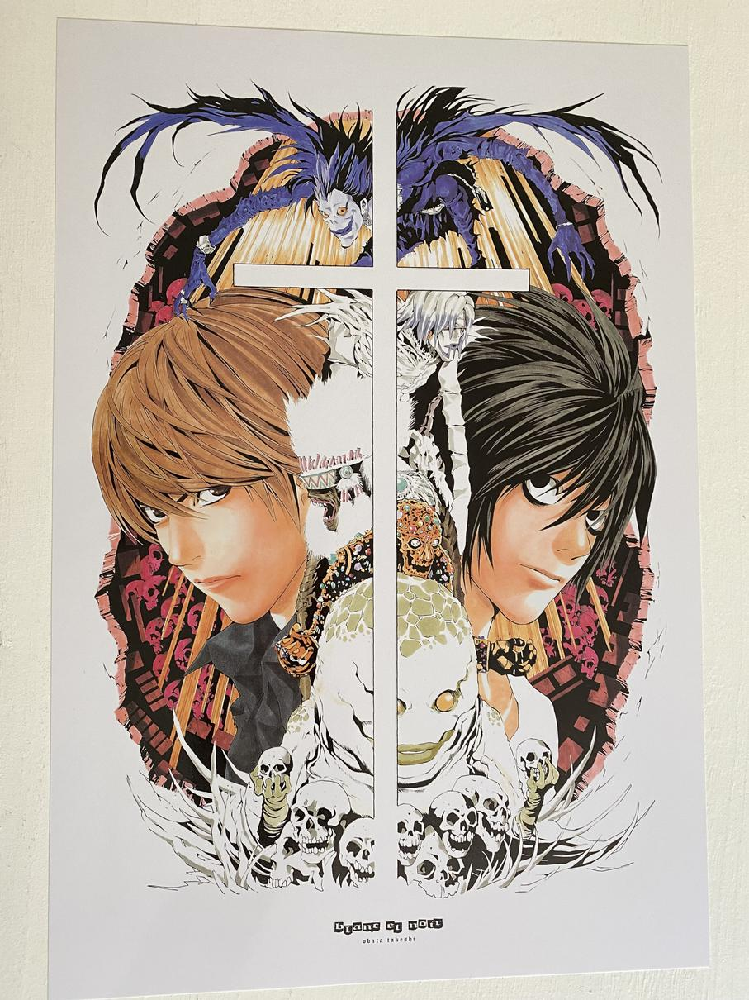

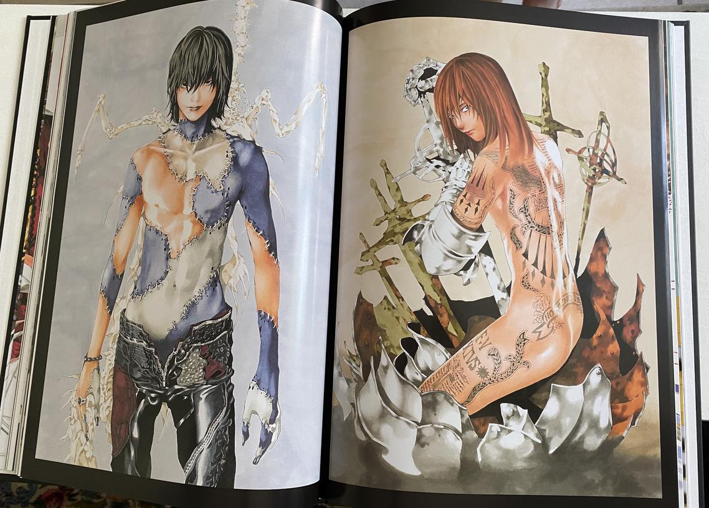

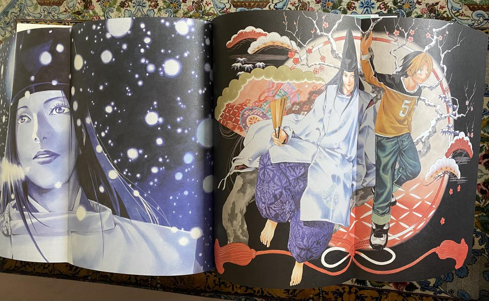

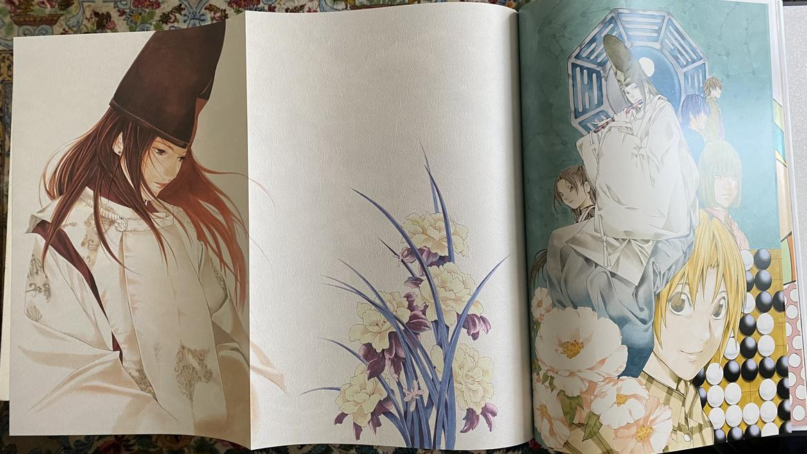

# Death Note Short stories

Quelques histoires courtes dans l'univers de Death Note quelques années après l'intrigue principale et des strips humoristiques.

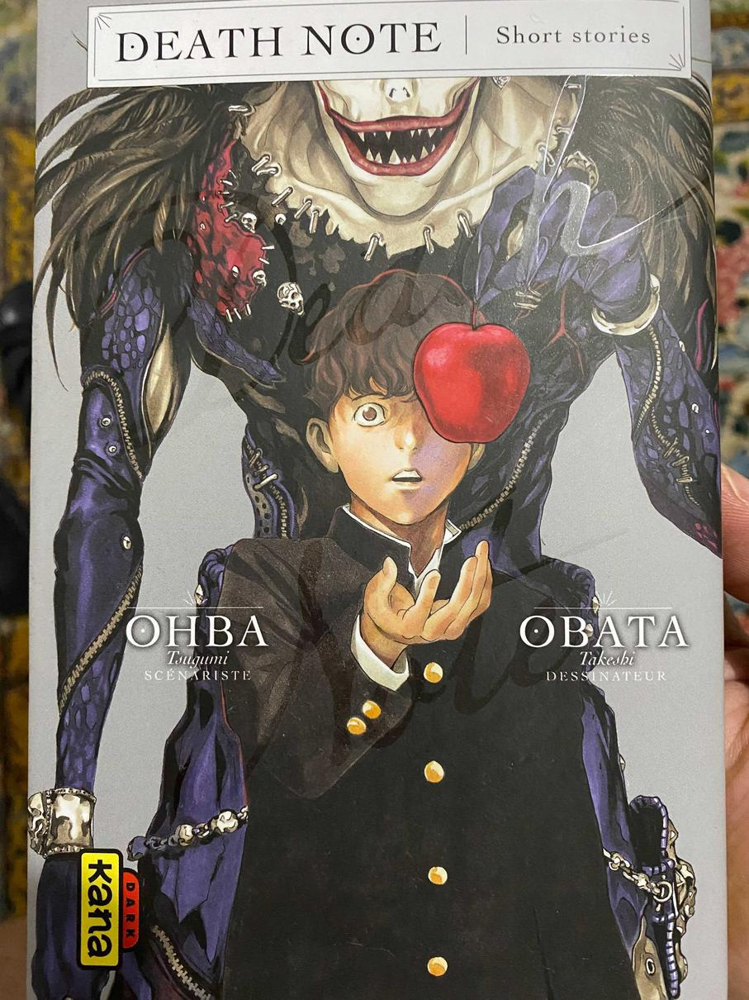

Les histoires se lisent bien, mais sont moins élaborées, ça reste honorable, mais pas exceptionnel. 
Les strips quant à eux me montrent à quel point l'humour japonais me semble parfois si décalé par rapport au mien… 
C'est comme la page humoristique à la fin de chaque tome de **L'Attaque des Titans**, presque gênant comme humour :sweat_smile:

# Spiderman - Bleu

Premier tome de la collection 2021 des 10 Marvel, **Spider-Man Bleu** : excellent duo de scénariste
et dessinateur, histoire sympa. Mais comme beaucoup de Comics Marvel ou DC Comics il faut avoir déjà
lu ou vu d'autres histoires pour tout comprendre.

# Batman DC Rebirth #3 Mon nom est Bane

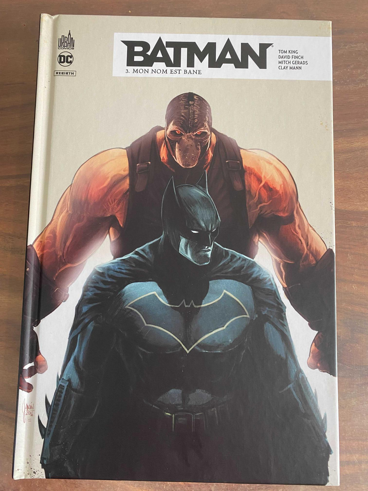

"Batman Rebirth - Mon nom est Bane" est le 3ème tome de la série "DC Rebirth".
J'aime beaucoup le personnage de Bane, et Selina Kyle aussi :smile:

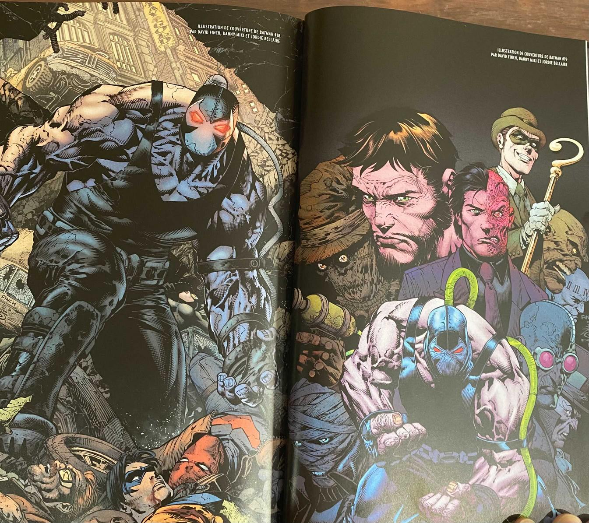

# Stormtroopers

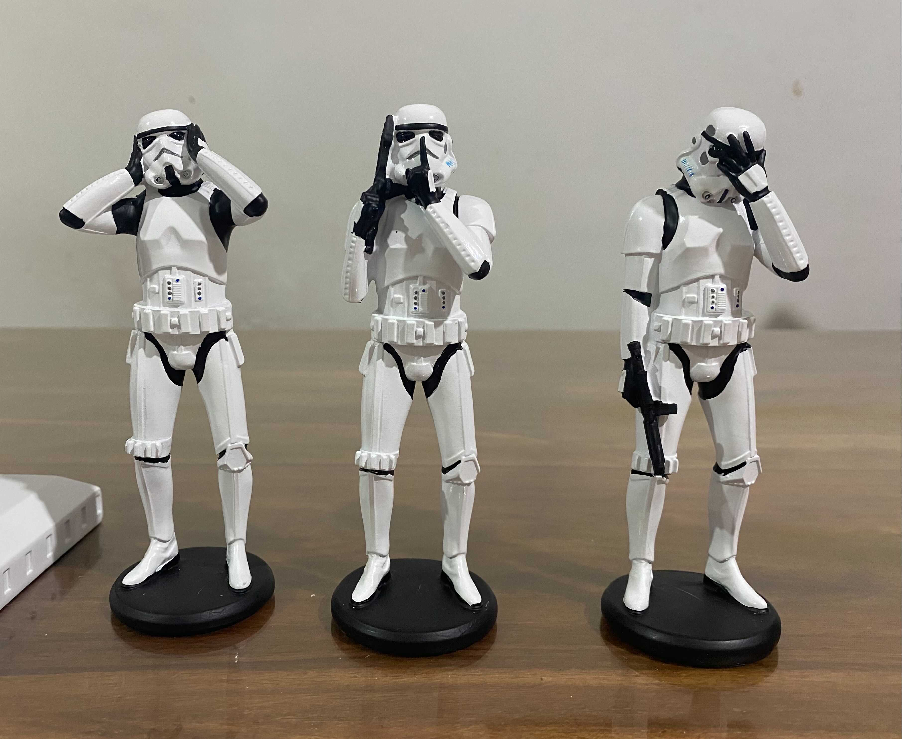

Et j'ai craqué après une annonce de mon libraire de BD préféré ce matin, je me suis précipité pour acheter les serre-livres et les trois Stormtroopers en style "singe de la sagesse". Il faut bien une troupe d'élite pour retenir Bane :smiley:

# Blacksad

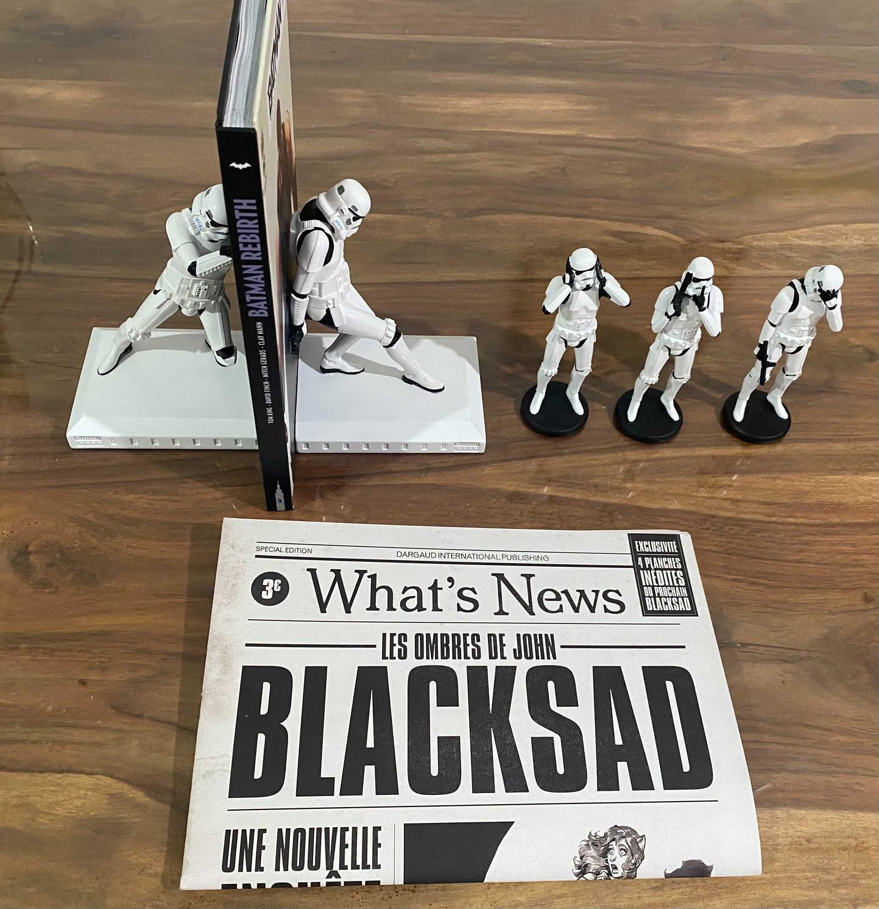

Et il y avait aussi un simili journal **Blacksad** qui m'a fait de l'œil.
