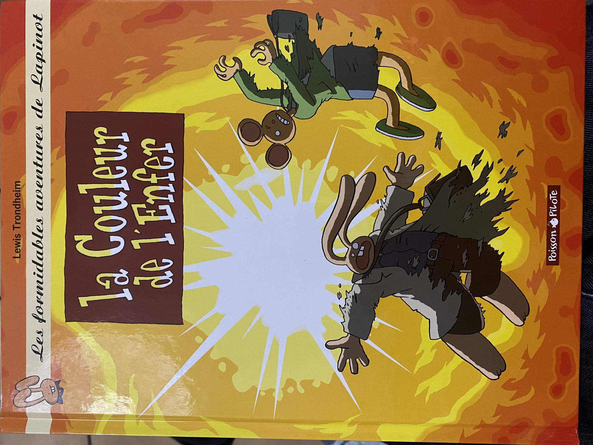
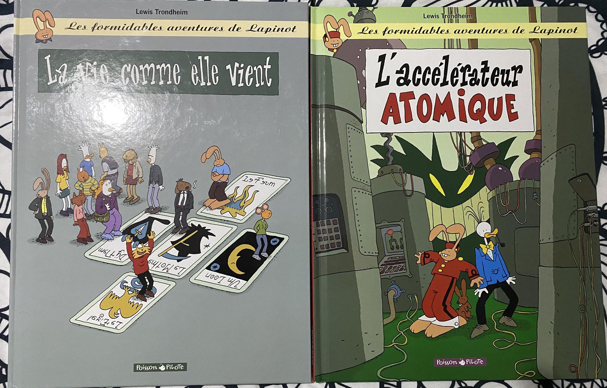

Mes lectures de ce weekend ! Beaucoup de BD en ce moment.

# Les 3 derniers Lapinot

J’ai commencé cette série bien après qu’elle soit finie. Je suis un grand fan de **Lewis Trondheim** que j’ai découvert avec **Donjon**, puis via l’éditeur **L’Association**. Comme d’habitude ces Lapinot sont assez drôle, parfois dans un univers anthropomorphique réaliste, parfois dans un univers totalement déjanté et irréaliste. 

L’exception à l’humour est l’avant dernier tome, **La vie comme elle vient**, qui est assez tragique et se finit par la mort d’un des personnages principaux. Il m’a même un peu chamboulé. Le dernier tome, **L’accélérateur atomique**, une fantaisie dans l’univers des années 50 de Spirou et Fantasio, fait totalement abstraction de cette mort, et conclut la série de façon totalement décalée et burlesque.

# Capricorne T12 d’Andreas

J’adore cet auteur dont j’ai aussi lu l’intégralité des **Rork**. Encore une fois l’auteur fait dans l’originalité, avec un album sans titre et totalement muet ! Il se déroule dans un décor enneigé, blanc immaculé, où justement le silence règne à cause des risques d’avalanche. On est toujours à la limite du fantastique et de l’aventure, il y a toujours une part de mystère à la fin de chaque tome : des énigmes se résolvent parfois, mais il y en a toujours de nouvelles !

# Carmen Mc Callum T10

Encore une fois aventure, thriller et SF sont au rendez-vous. J’aime un peu moins le trait depuis le changement de dessinateur au tome 9, et encore moins la pirouette scénaristique qui prétextait dans le tome précédent une chirurgie esthétique suite à un grave accident pour justifier le changement de tête de l’héroïne :wat:, mais ça reste assez agréable à lire, sans prise de tête.

# Les Montagnes Hallucinées de Gou Tanabe

Et enfin, très gros coup de cœur pour un auteur japonais, **Gou Tanabe**, pour ses adaptation en manga de l’œuvre horrifique du génial **H.P. Lovecraft** ! J’ai déjà acheté la plupart des tomes, et ce week-end j’ai lu les tomes 1 et 2 des Montagnes Hallucinées. 

Je trouve que l’auteur arrive à restituer fidèlement l’ambiance sombre, désespérée et horrifique des romans de Lovecraft. Comme on le voit ici, son style est très européen. 

Gou Tanabe arrive assez bien à dessiner l’indicible des romans, quitte à avoir parfois un trait flou, comme s’il était impossible de représenter graphiquement les dieux abominables et autres créatures extra-terrestres monstrueuses de l’œuvre de Lovecraft.

J’adore les couvertures en simili-cuir de cette série : je pense que c’est une référence au _Nécronomicon_, le livre maudit fictif souvent cité dans les histoires de Lovecraft, et dont les rares exemplaires sont censés être reliés en peau humaine 😉
