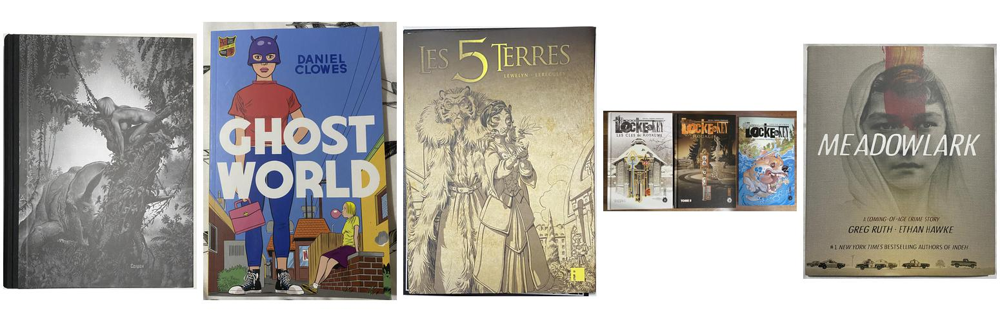
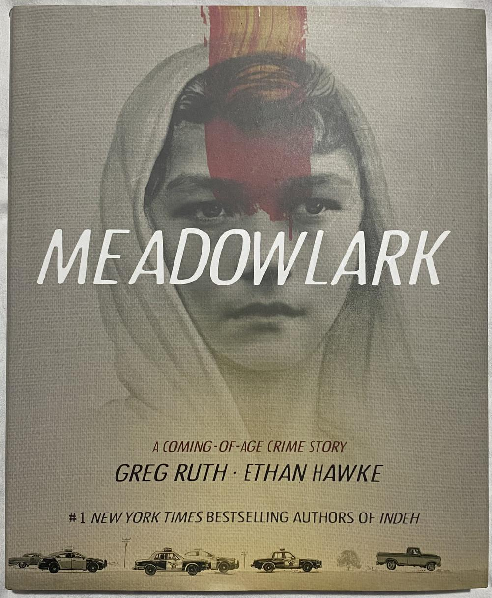

I splurged again this month in terms of buying comics :scream:

# Les 5 Terres - L'intégrale en édition limitée

I discovered "Les 5 Terres" recently, I liked volume 1. As I was talking about it briefly on the [Bubble Facebook group](https://www.facebook.com/groups/BubbleBD), an absolute fan told me about the release of a [limited edition complete](https://www.editions-i.com/ouvrages/les-5-terres-angleon-40.htm). It's a thick volume with a very nice hardback cover, dust jacket, 6 bookplates signed by the authors, with a limited edition of 280 copies at the modest price of... 235 €!

And obviously I cracked! But I do not regret my purchase, the volume is splendid.

The bookplates are beautiful but, for now, I'm leaving them safely in the comic.

# Corben - Complete publications from Eerie & Creepy

I discovered **Corben** through [Métal Hurlant](). The author [died in 2020](https://www.lepoint.fr/culture/richard-corben-mort-d-un-visionnaire-11-12-2020-2405336_3.php).

That's why his publisher, **Delirium**, decided to pay tribute to him and to [release an integral](https://labeldelirium.com/book/eerie-creepy-integrale-richard-corben/) of his publications in the magazines **Eeerie** and **Creepy**. This limited and numbered edition of 2500 copies, with silk-screened cloth back, is proposed for the 10th anniversary of DELIRIUM.

There too, this complete set is superb.

# Locke & Key

I continue my reading of **Locke & Key**. This time, as a gift for the purchase of the two volumes, I got a mini-comics with two short and funny stories.

# Ghost World

I read **Ghost World** by **Daniel Clowes** in English this weekend. It's a "_Coming of age_" comics about Enid and Rebecca, two 18 years old friends, at the turning point of childhood and adulthood. Rebels, cynical, frustrated of having no boyfriend, the two girls start growing apart.

Very interesting comics, sometimes hard to understand for me because of the US slang, it's one of the most renowned independent American comics. There'd even a film based on the book, I haven't seen it.

# Meadowlark

Another comics in English that I read last night, **Meadowlark** by **Ethan Hawke** (the actor!) and **Greg Ruthe**. It was not what I expected: I thought it’d be “just” a graphical novel, but instead I received a punch in the stomach! Yes, as the backcover says, it’s a coming of age story about the dysfunctional relation between a son and his father, but above all a captivating, very violent, thriller. And the violence keeps cascading until the end.

The drawing is beautiful, very realistic, although very static even when there should be movement. It’s a bit weird, like if each scene was a painting.

I loved the comics but it’s not for the faint of heart.