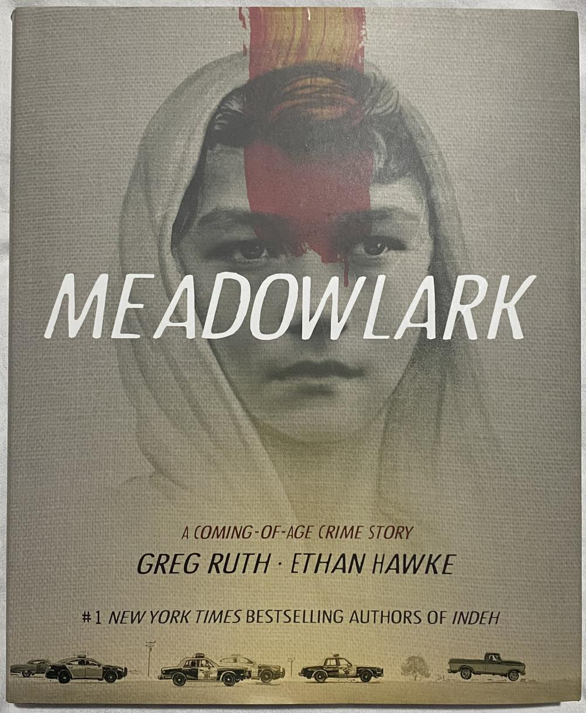

J'ai encore fait quelques folies ce mois-ci en terme d'achats de bandes dessinées :scream:

# Les 5 Terres - L'intégrale en édition limitée

J'ai découvert « Les 5 Terres » récemment, j'ai bien aimé le tome 1. Comme j'en parlais brièvement sur le [groupe Facebook Bubble](https://www.facebook.com/groups/BubbleBD), un fan absolu m'a parlé de la sortie d'une [intégrale en édition limitée](https://www.editions-i.com/ouvrages/les-5-terres-angleon-40.htm). C'est un épais volume avec une très belle couverture cartonnée toilé, jaquette, 6 ex-libris signés par les auteurs, avec un tirage limité à 280 exemplaires au prix modique de… 235 € !

Et évidemment j'ai craqué ! Mais je ne regrette pas mon achat, le volume est splendide.

Les ex-libris sont très beaux mais, pour l'instant, je les laisse en sécurité dans la BD.

# Corben - Intégrale des publications Eerie & Creepy

J'ai découvert **Corben** par l'intermédiaire de [Métal Hurlant](). L'auteur est [mort en 2020](https://www.lepoint.fr/culture/richard-corben-mort-d-un-visionnaire-11-12-2020-2405336_3.php). 

C'est pourquoi son éditeur, **Delirium** a décidé de lui rendre hommage et de [sortir une intégrale](https://labeldelirium.com/book/eerie-creepy-integrale-richard-corben/) de ses publications dans les revues **Eeerie** et **Creepy**. Cette édition limitée et numérotée à 2500 exemplaires, avec dos toilé et sérigraphié, est proposée dans le cadre des 10 ans de DELIRIUM.

Là aussi cette intégrale est superbe.

# Locke & Key

Je continue ma lecture de **Locke & Key**. Cette fois-ci, en cadeau pour l'achat des deux tomes, j'ai eu une mini-BD hors commerce avec deux courtes histoires assez drôles.

# Ghost World

J'ai lu **Ghost World** de **Daniel Clowes** en anglais ce week-end. C'est une bande dessinée "_Coming of age_" sur Enid et Rebecca, deux amies de 18 ans, à la charnière de l'enfance et de l'âge adulte. Rebelles, cyniques, frustrées de ne pas avoir de petit ami, les deux filles commencent à s'éloigner.

Bandes dessinées très intéressantes, parfois difficiles à comprendre pour moi à cause de l'argot américain, c'est l'une des bandes dessinées indépendantes américaines les plus réputées. Il y a même un film basé sur le livre, je ne l'ai pas vu cependant.

# Meadowlark

Une autre BD en anglais que j’ai lue hier soir, Meadowlark d'Ethan Hawke (l’acteur !) et Greg Ruthe. Ce n’était pas ce à quoi je m’attendais : Je pensais que ce serait “juste” un roman graphique, mais à la place j’ai reçu un coup de poing dans l’estomac ! Oui, comme le dit la quatrième de couverture, c’est une histoire de passage à l’âge adulte, qui parle de la relation dysfonctionnelle entre un fils et son père, mais c’est avant tout un thriller captivant et très violent. Et la violence ne cesse de monter en cascade jusqu’à la fin. 

Le dessin est magnifique, très réaliste, bien que très statique même quand il devrait y avoir du mouvement. C’est un peu bizarre, comme si chaque scène était un tableau.

J’ai adoré la bande dessinée, mais ce n’est pas pour les âmes sensibles.
