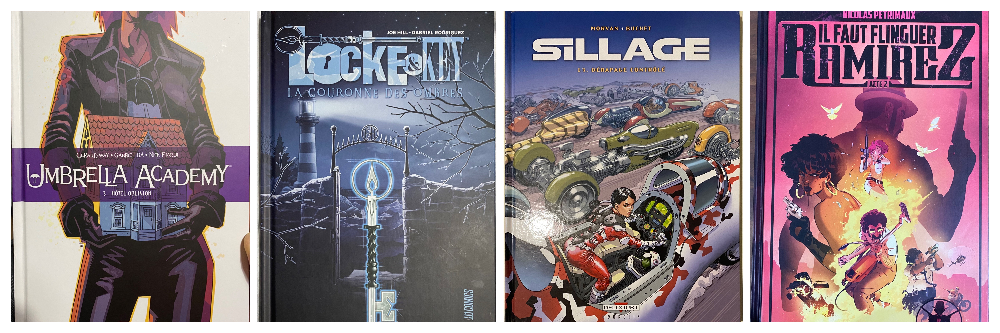

Here are some reading notes from the last three days.

**Setting the context**: for most series I read very spaced out, I have a hard time fully memorizing the story, characters, unresolved ongoing plots... And sometimes when I start a new volume, I don't know who so-and-so is, if what's-his-name is good, bad or ambiguous, etc. 😅 

That's what happened to me on several comics here.

# Umbrella Academy T3

I loved the Netflix series, funny, crazy. Then I started reading the comics. They are funny and weird too, but even more than the TV series! And the drawing is particular, at the limit of the burlesque I find... And as much as I managed to follow the volume 1 (for your information the story has almost no relation with the scenario of the series), I have almost no memory of what happens in the volume 2...

And I understood **nothing** in volume 3, really nothing! After a while, I can hold on to the plot again and enjoy reading, but I don't understand anything about what's going on, the characters' goals, the space travel, the time travel, or whatever. I was confused at the end, I feel like I went from one thing to another all the time.

Maybe there is a higher level of reading, or some subtleties, that I missed?

# Sillage T13

Same effect of my poor memorization of certain characters or plots, but to a lesser degree. I've loved **Sillage** since the beginning. Recently, in order to read volumes 11 and 12, I quickly reread the whole series to get back into the swing of things. But now, a few months later, I'm starting volume 13, and I'm lost 😅

The story is still generally understandable and pleasant to read, but I have the impression each time that I don't understand certain plots because I don't know if this or that character is "nice" or not.

I will nevertheless read the rest with pleasure!

# Il faut flinguer Ramirez Acte 2

Praise be to Nicolas Pétrimaux, who included a QR code at the beginning of the comic that points to a six-minute video summarizing Act 1 in still images and voice-over! It served me well. Act 2 is as funny, offbeat and breathtaking as Act 1, maybe even more bloody: people are dying by the dozen around this poor Ramirez who doesn't seem to control anything in his life... except that we realize he has a much richer life than we thought!

Interesting revelations are made in the second part of the comic. I really like the road-movie that serves as the plot of the comic, and I invite keen eyes to spot at least one explicit reference to "**Thelma and Louise**". The fake ad pages are still fun to read, and I can't wait to read the rest!

# Locke & Key T3

Again, I had forgotten some details from volumes 1 and 2 (too many keys, some details about Dodge, some secondary characters...) but I managed to dive back in very quickly. And once again, I loved it.

I feel a certain anguish when reading each volume, I am afraid for the heroes, and I find that the horrific side is very successful. I am also impatient to read the next volume.
