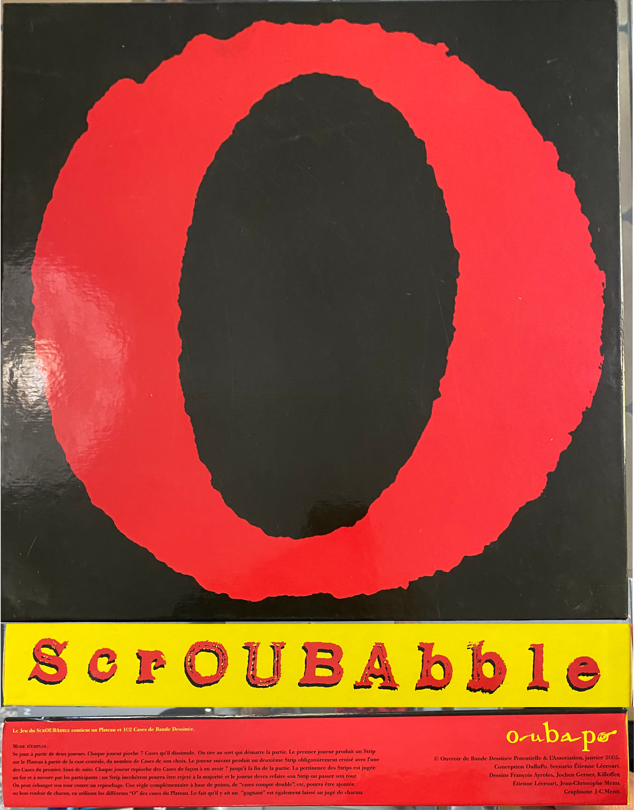
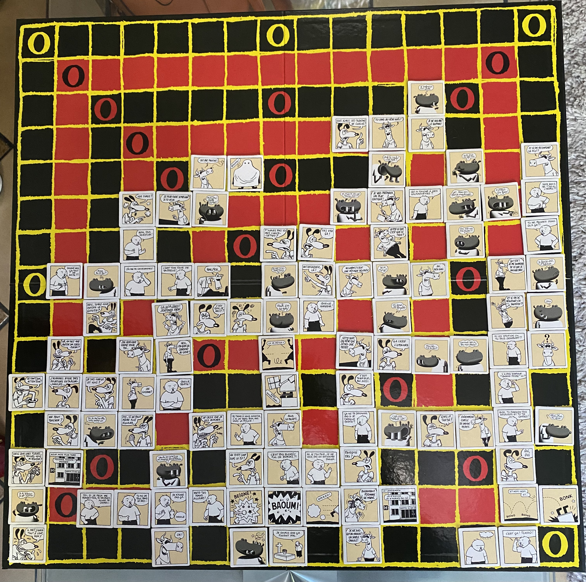

Dimanche dernier, pendant la visite de ma belle-sœur, je me suis dit qu'on allait remplacer la traditionnelle partie de jeu de société par une partie de Scroubabble, le jeu inspiré de l'[Oubapo](https://fr.wikipedia.org/wiki/Ouvroir_de_bande_dessin%C3%A9e_potentielle) et édité par [L'Association](https://www.lassociation.fr/) 😊

D'autres personnes connaissent ? Personnellement je ne compte pas de points, on essaie juste de faire les histoires les plus cohérentes et drôles possibles.

