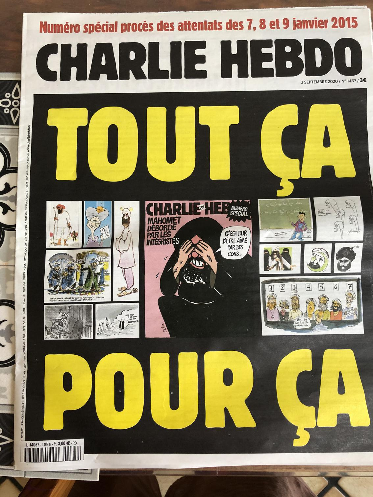
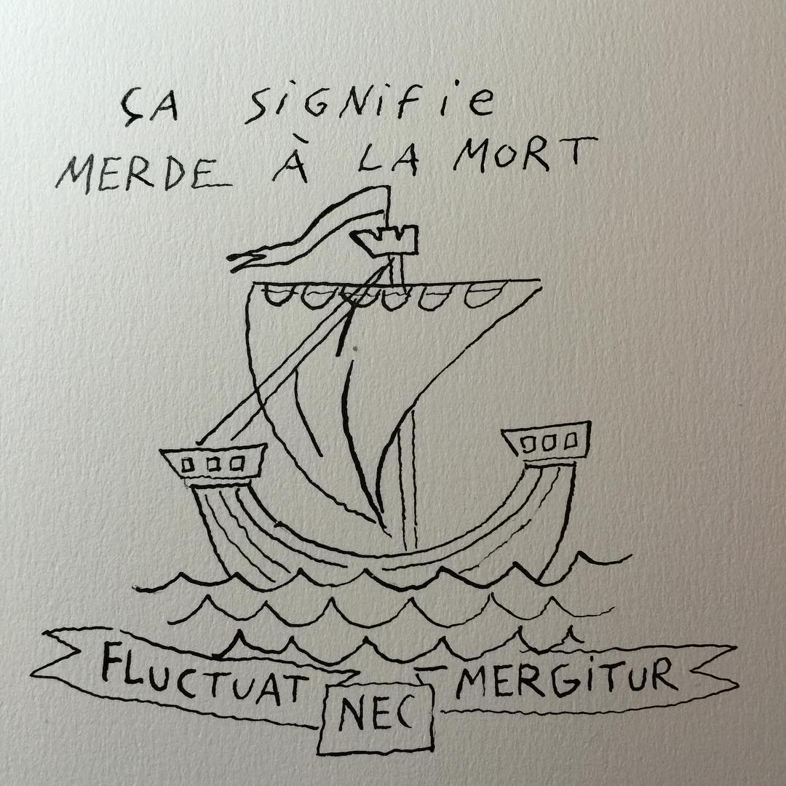

Five years ago, between the 7th and 9th of January 2015, [3 islamic terrorists killed 17 people in France](https://en.wikipedia.org/wiki/Charlie_Hebdo_shooting): journalists, cartoonists, police officers, customers, in the name of their sick beliefs. Some of these people, like the economist Bernard Maris and the cartoonists Cabu or Wolinski were people I really like. Cabu for example appeared in a TV show for kids that I loved in the 80's. These were all nice people.

> **“It's everybody's fault: the Republic's fault, the Occident's fault, the Capitalism's fault… but not terrorists' fault”**

Immediately after the tragic events, someone, whom I thought was part of my family, wrote multiple posts on Facebook saying that terrorism was not due to, well… islamic terrorists, but to “Capitalism”, to “injustice” or some other scapegoats. He wrote that Charlie Hebdo was a racist magazine, that we should not unite under the “values of the Republic”, because the Republic is capitalistic, that criticising a religion is racism and went on, promoting Marxism…

My wife and I were shocked. We tried to respond to his sickening messages but only ended being blocked by a few people from my own family who supported him, and being ignored forever by them…

A few months later, in November 2015, [the unspeakable happened again in Paris, more than 130 people were killed and 400 injured](https://en.wikipedia.org/wiki/November_2015_Paris_attacks). Again in the name of Islam…

It is this same sick religious belief that has changed my native country, Iran, into a murderous dictatorship 40 years ago.

> **Fluctuat Nec Mergitur**

My Facebook  and Twitter profile picture dates from that time. [It’s a drawing by the talented artist Joann Sfar](https://unknowngenius.com/blog/archives/2015/11/14/fluctuat-nec-mergitur-by-joann-sfar/). 
It is the Latin motto of Paris, 
“[Fluctuat Nec Mergitur](https://en.wikipedia.org/wiki/Coat_of_arms_of_Paris#Motto)”,
“[she] is rocked [by the waves], but does not sink”. I have not changed it in five years.

We live in a free country, blasphemy does not exist, we are free to think and debate ideas, beliefs, and to criticize them. Nothing has changed, we will not sink. 

Five years later, I will not let any political or religious ideology threaten my freedom.

Five years later, I will not forgive people who support the unspeakable in the name of their own sick ideology.

**\#JeSuisCharlie**
