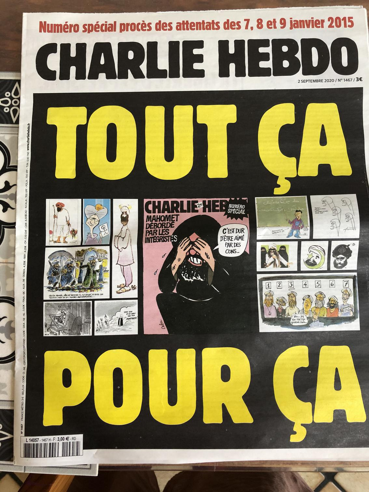
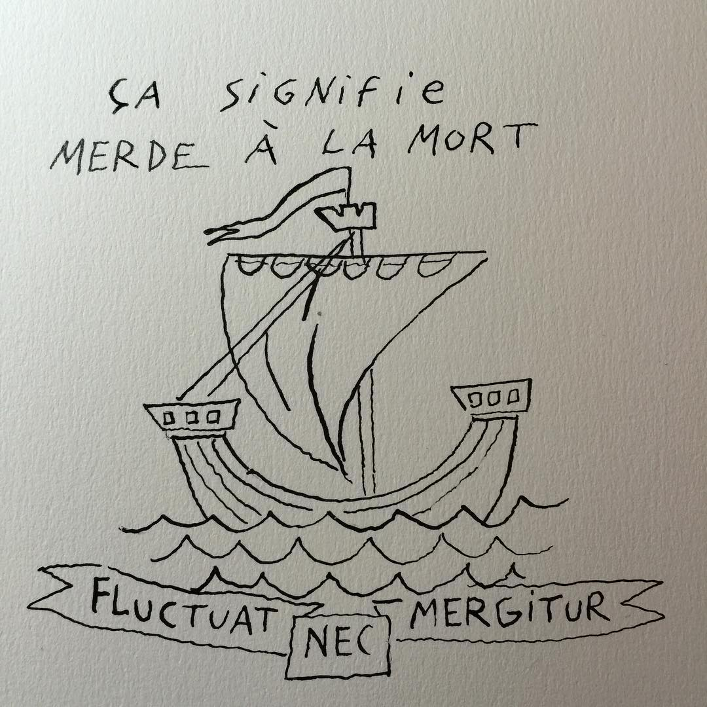

Il y a cinq ans, entre le 7 et le 9 janvier 2015, [3 terroristes islamistes ont tué 17 personnes en France](https://fr.wikipedia.org/wiki/Attentat_contre_Charlie_Hebdo) : journalistes, dessinateurs, policiers, clients de magasin, au nom de leurs croyances malades. Certaines de ces personnes, comme l'économiste Bernard Maris et les dessinateurs Cabu ou Wolinski étaient des personnes que j'aime beaucoup. Cabu, par exemple, animait une émission de télévision pour enfants que j'aimais beaucoup dans les années 80. Tous étaient des gens bien.

> **« C'est la faute de tout le monde : la faute de la République, la faute de l'Occident, la faute du Capitalisme... mais pas celle des terroristes »**

Immédiatement après ces événements tragiques, quelqu'un, que je croyais faire partie de ma famille, a écrit de nombreux messages sur Facebook en disant que le terrorisme n'était pas dû à, eh bien... des terroristes islamiques, mais au « capitalisme », à « l'injustice » ou à d'autres boucs émissaires. Il a écrit que Charlie Hebdo était un magazine raciste, que nous ne devrions pas nous unir sous les « valeurs de la République », parce que la République est capitaliste, que critiquer une religion est du racisme et a continué en faisant la promotion du marxisme…

Ma femme et moi avons été choqués. Nous avons essayé de répondre à ses messages écœurants, mais nous avons fini par être bloqués par quelques personnes de ma propre famille qui le soutenaient, et nous avons été ignorés à jamais par eux…

Quelques mois plus tard, en novembre 2015, [l'indicible s'est à nouveau produit à Paris, faisant plus de 130 morts et 400 blessés](https://fr.wikipedia.org/wiki/Attentats_du_13_novembre_2015_en_France). Toujours au nom de l'Islam…

C'est cette même croyance religieuse malsaine qui a transformé mon pays de naissance, l'Iran, en une dictature meurtrière il y a 40 ans.

> **Fluctuat Nec Mergitur**

Ma photo de profil Facebook et Twitter date de cette époque. 
[C'est un dessin du talentueux artiste Joann Sfar](https://www.konbini.com/fr/tendances-2/fluctuat-nec-mergitur-quand-la-devise-de-paris-refait-surface-le-terrorisme/). 
C'est la devise latine de Paris, 
« [Fluctuat Nec Mergitur](https://fr.wikipedia.org/wiki/Fluctuat_nec_mergitur) », 
« Il est battu par les flots, mais ne sombre pas ». Je ne l'ai pas changée en cinq ans.

Nous vivons dans un pays libre, le blasphème n'existe pas, nous sommes libres de penser et de débattre des idées, des croyances, et de les critiquer. Rien n'a changé, nous ne coulerons pas. 

Cinq ans plus tard, je ne laisserai aucune idéologie politique ou religieuse menacer ma liberté. 

Cinq ans plus tard, je ne pardonnerai pas aux gens qui soutiennent l'indicible au nom de leur propre idéologie malade.

**\#JeSuisCharlie**
